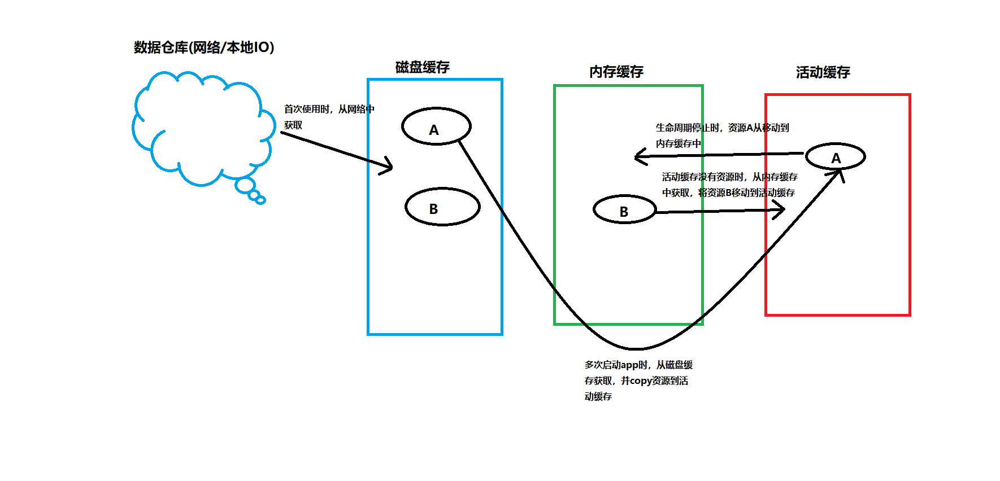

# CustomGlide
依据Glide源码分析，参考Glide生命周期与缓存核心思想，简单实现了自定义的Glide，后续需要逐步完善
一、生命周期
1.构建空白的Fragment，利用fragment的生命周期控制glide的加载、停止与资源释放。
2.glide在构建fragment时的一个技巧，使用handler.sendMessage()，来监听加入到队列中的fragment是否完成提交。因为提交不是同步进行的。
此外，glide还使用了缓存，确保glide在其他地方使用时，不会重复创建fragment，解决fragment在提交不及时带来的多个fragment问题
二、缓存
1.资源封装  从网络或本地IO获取资源
2.活动缓存 活动缓存提供位图给视图;
3.内存缓存 生命周期停止时，利用LRUCache 缓存活动缓存内的资源
4.磁盘缓存  本地磁盘存储，key为uri 编码生成的64位序列号，缓存到SD卡中

三、缓存执行流程
1.
首次启动app,去网络中下载图片，保存在磁盘缓存 和 活动缓存(/sd/disk_lru_cache_path/key)
第2次~第N次加载图片时，会去活动缓存中获取

2.
app返回桌面(不可见)时，资源从活动缓存中释放，并添加到内存缓存。重新返回app时，从内存缓存中获取。
下一次及后面加载相同图片时，直接从活动缓存中获取

3.
当app销毁后，内存缓存和活动缓存释放资源。 下一次进入时，会从磁盘缓存中获取
后面加载相同图片时，直接从活动缓存中获取。

